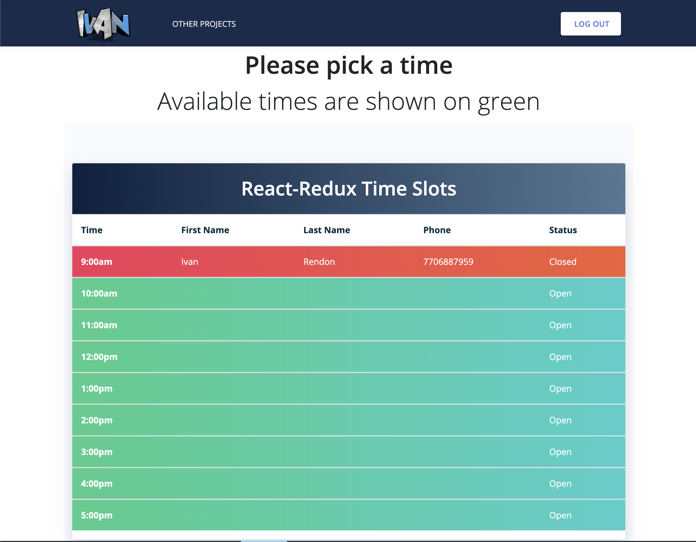

# Time Slots App


## Approach
This is a front end application created using React and Redux as part of a coding assessment following the requirements specified in the instructions, I decided to incorporate local storage since the application isn't connected to the back end. 
I choose to store the appointments in the client's local storage to have persistent data shown in case the user refreshes the page or leaves and comes back.
Live Demo [here]() 

### Instructions
  - Build a page to shows a list of time slots from 9 to 5
  - Grab the information from the user via modal popup 
  - Change the color of the slot that has been previously selected indicating that is closed or not available
  - Pre-populate the modal when the user clicks the slot again containing the slot's information in the modal fields
    
## As a User
- As a user I should be able to see the time slots that are open displayed in green and red for the closed ones      
- As a user I should have the ability to type my information and view it in the browser in the corresponding slot I choose
- As a user I should be able to edit and delete the slot I have previously selected

## Technologies Used
- React
- Redux
- No Back-end for this application

## Preview



Click [here](react-redux-appointment-scheduling-sjarrett) for a live demo site.

This project was bootstrapped with [Create React App](https://github.com/facebook/create-react-app).

## Credits
* [React](https://reactjs.org)
* [Redux](https://redux.js.org)
* [Express](https://expressjs.com)
* [Node](https://nodejs.org/en/)
* [Bootstrap](http://getbootstrap.com)
* [Font Awesome](http://fontawesome.io)


## Installation
``` bash
# Clone this repository
git clone https://github.com/ivansito87/React_Redux_App.git
# Go into the repository
cd React_Redux_App
# Install dependencies with yarn
yarn install
# Run the app
yarn start
```

**Example Redux Action:** 
```javascript
 export const updateAppointment = (appointmentData) => ({
  type: UPDATE_APPOINTMENT,
  payload: {
    appointmentData
  },
  appointmentData
});
```

## License
This software is licensed under The MIT License (MIT). Which means that you can use, copy, modify, merge, publish, distribute, sublicense, and/or sell copies of the software. But you always need to state that xWeb is the original author of this template.

Made with ❤️ designed, developed and maintained by [Ivan Rendon](https://www.ivanrendon.dev/).